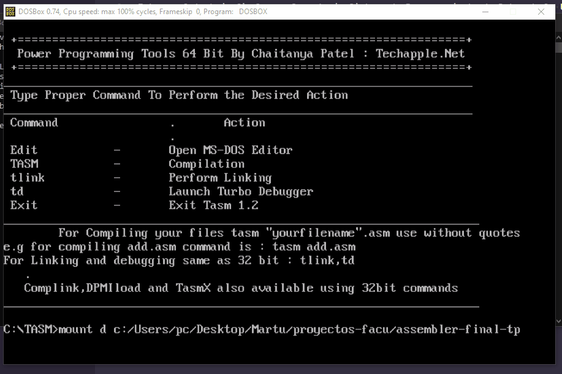

# assembler-final-tp
Este es el trabajo final para la materia Sistema de Procesacmiento de Datos de la Universidad Nacional de San Martin.

## Estructura

- int60.asm, int80.asm: corresponden a interrupciones personalizadas que se utilizan durante la ejecución del programa.

- main.asm: código principal del programam

- lib.asm: librería que contiene todas las funciones que se utilizan en main.asm

- compi.bat: contiene todos los comandos necesarios para ejecutar el programa

# Instrucciones
Para ejecutar este juego es necesario tener instalado el compilados de lenguaje ensambladorx86 de 16 bits para MS-DOS o DOSBox (TASM)

Se deberá montar el compilador en el directorio del proyecto y luego escribir el comando "compi" para ejecutar el juego.

comandos:
mount d c:/Users/pc/carpeta-del-proyecto
d:
compi

